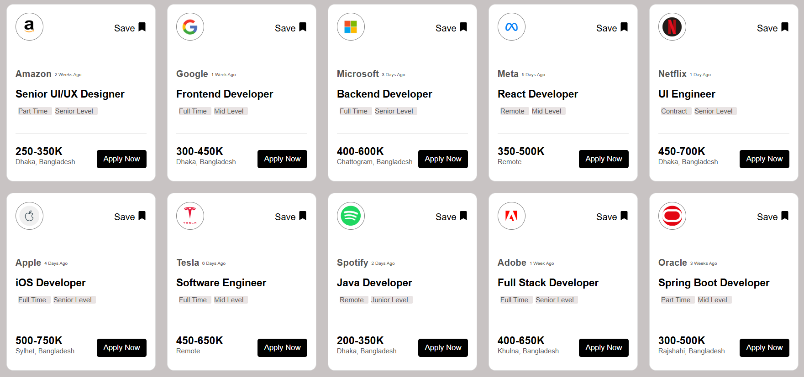

# React + Vite

# 🧑‍💻 Job Card UI Project

This is a simple React project that displays job cards in a responsive grid layout. Each card shows company details, job title, job type, salary, and location and etc.

---

## 🚀 Features

- Reusable React components
- Responsive card layout using Flexbox
- Clean and modern UI design
- Icon integration using React Icons
- Hover effects on buttons

---

## 🛠️ Technologies Used

- React.js
- CSS3
- React Icons

---

## 📸 Screenshot

