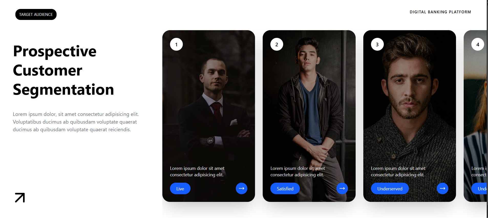

## Recently, I built a simple UI project using React and Tailwind CSS.

This project helped me practice component-based development, props, and responsive design. Tailwind made it much easier to style the interface quickly and keep the code clean.

---

## 🛠️ Technologies Used

- React.js
- Tailwind CSS
- React Icons

---

## 📸 Screenshot

---

Every small project teaches me something new and improves my frontend development skills.

---